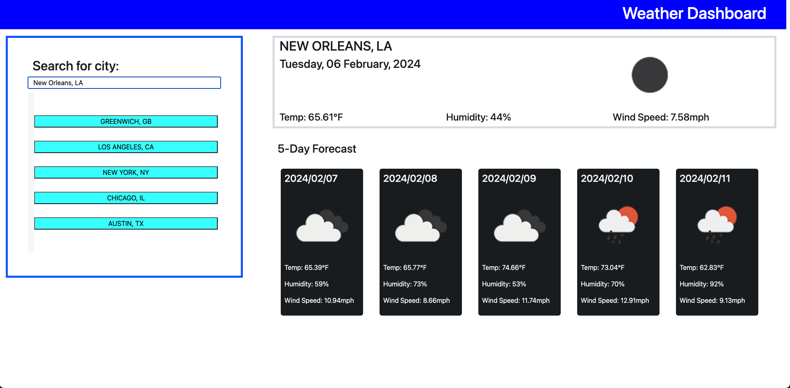

# UTA Coding Bootcamp Challenge 6 -- Weather Dashboard

## Description

This is my submission for the sixth challenge in the UTA/EdX Coding Bootcamp. The goal of this challenge was to create an interactive weather dashboard using a server-side API.

<a href="https://njmeister.github.io/Challenge6-WeatherDashboard/">Link</a>

## Installation

N/A

## Usage

The website presents the user with an input to search for a city. Once a city has been typed, press the enter key to pull up the current weather and a 5-day forecast. On reload, the five most recently searched cities are displayed as buttons for a quick search. 

## Credits

N/A

## License

This repo uses an MIT License. See above for details.
